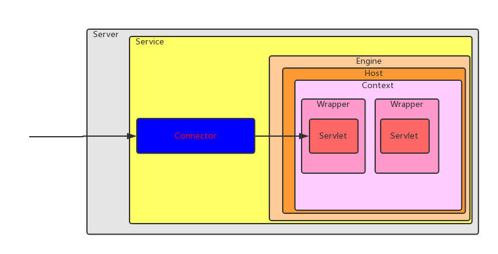

# How Tomcat Works 

#### tomcat启动流程

1. 启动器启动 : 创建连接器，初始化servlet容器，包括给servlet容器添加阀，将连接器和容器关联起来，初始化连接器，启动连接器线程

3. 容器初始化： 构建管道，设置基础阀

3. 连接器初始化和启动：连接器会初始化处理器线程池，监听socket套接字

4. 处理器线程： 根据socket传输的内容创建request，response，并构造相关信息，调用容器的invoke方法，此后所有的动作都是在处理器线程中完成的

5. 容器invoke： 调用管道的invoke方法

6. 管道invoke： 使用管道上下文对象调用阀的invoke

7. 阀invoke： 使用管道上下文调用下个阀的invoke，直到调用基础阀的invoke

8. 基础阀invoke： 让容器加载servlet并初始化，然后调用servlet的service方法

9. servlet实例的service： 根据request内容构造response，并将结果返回给客户端

##### 线程总体划分

一共有三个大的线程

1. 主线程，前台线程，软件启动时的主线程
2. 连接器线程，后台线程，主要负责监听网络套接字的连接
3. 处理器线程组，后台线程，根据套接字的内容处理业务逻辑

##### 容器之间的关系
